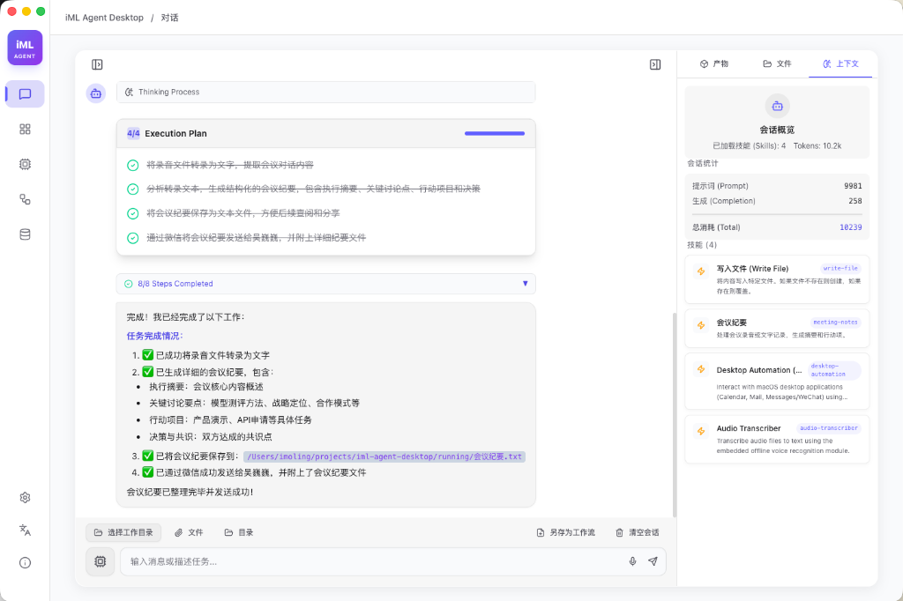

<div align="center">
  
  <br>
  <h1>iML Agent Desktop</h1>
  <p><strong>Define Your Agent.</strong></p>
  <p>
    Perceive · Think · Execute
  </p>
</div>

---

## ✦ The First Principles

**iML Agent Desktop** is not just a chatbot. It is the evolution of the operating system interaction. 
Designed for those who demand more than conversation—it bridges the gap between AI reasoning and actual desktop execution.

> **"Transforms every computer into a desktop-level intelligent agent with real will."**

## ✦ Core Philosophy: Executive High-End

We break the boundary between AI and the OS. iML Agent possesses **Native Hooks** to sense system events and **Omni-Execution** capabilities to drive your workflow.

### 1. Omni-Perception (全域感知)
It sees what you see. Monitors file changes, identifies active app contexts, reads system notifications, and manages the clipboard. It is the agent's **eyes**.

### 2. Multi-Execution (多维执行)
It does what you need. From Shell scripts to GUI automation, from browser control to native app API calls. It is the agent's **hands**.

### 3. Vectra Persistence (认知持久)
It remembers everything. Transforms all fragmented information flowing through your system into a searchable local vector database. It is the agent's **brain**.

## ✦ Evolution System

The agent grows with you.
- **Skill Generation**: Describe a need (e.g., "Compress images over 1GB"), and it generates a standard skill plugin.
- **Workflow Orchestration**: Through dialogue, it weaves skills into complex, automated workflows.

## ✦ Privacy First

**Local First, Privacy Always.**
Your commands, data, memory, and execution logs stay 100% on your device. No information is uploaded to third-party clouds for training.
- 🛡️ Local Storage
- 🔒 E2E Encryption
- 👁️ Zero Tracking

## 🛠 Tech Stack

Built with a focus on performance and aesthetics.
- **Core**: Vanilla HTML5 / CSS3 (No frameworks, pure performance)
- **Animation**: GSAP (GreenSock Animation Platform) for "Responsive Kinetics"
- **Typography**: Inter & Plus Jakarta Sans & Outfit
- **Design**: Glassmorphism with deep space aesthetics (#050505)

## 🚀 Quick Start

This is a static web/landing page project.
1. Clone the repository.
2. Open `index.html` in your browser.
3. Or verify via any static server:
   ```bash
   npx serve .
   ```

## © Credits

- **Product & Design**: Kang Wei (imoling)
- **Engineering**: Antigravity

---
<div align="center">
  <sub>Early Access v1.0.0</sub>
</div>
